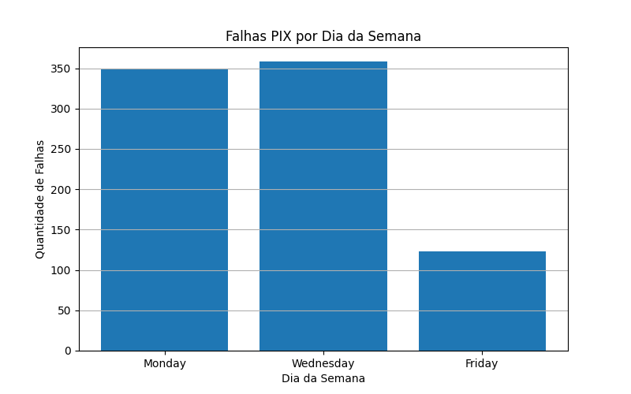
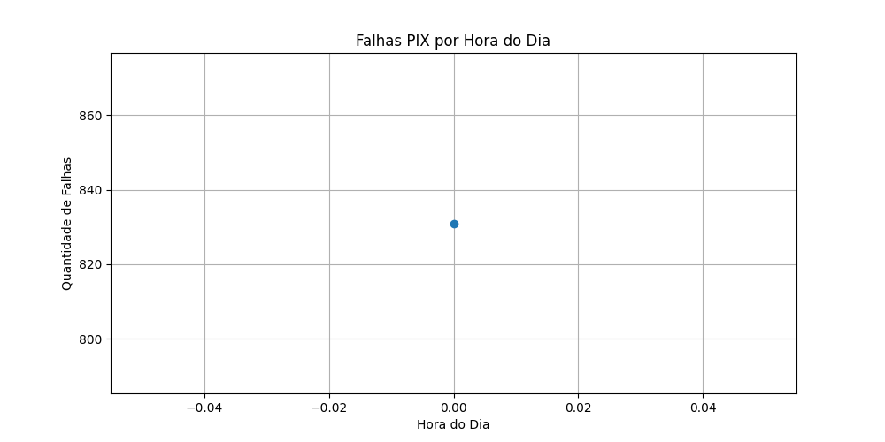

# Will Bank – Case Técnico: Senior Analytics Engineer

**Autor:** Washington (Kim)

---

## Objetivo do Case

Este projeto apresenta a solução para o case técnico da vaga de **Senior Analytics Engineer** no Will Bank. O objetivo principal foi desenvolver um **pipeline de dados robusto e escalável em múltiplas camadas** (Raw → Bronze → Silver → Gold), com foco em:

* **Detecção de Inconsistências**: Identificar falhas e inconsistências em transações PIX.
* **Enriquecimento de Dados**: Agregar valor aos dados transacionais com informações demográficas dos clientes.
* **Proposta de Evolução**: Sugerir a ingestão de dados via API externa para enriquecimento contínuo.
* **Visão Estratégica**: Apresentar sugestões técnicas e de negócio que vão além do escopo solicitado, visando a melhoria contínua dos processos de dados.

---

## Estrutura do Projeto

O repositório está organizado de forma a garantir a rastreabilidade, manutenibilidade e clareza do fluxo de dados, desde a origem até a camada de consumo.

```bash
willbank-analytics-case/
│
├── data/
│   ├── raw/                          # Dados originais fornecidos (core_account, core_pix, customer)
│   │   ├── core_account.csv
│   │   ├── core_pix.csv
│   │   └── customer.csv
│   ├── bronze/                       # Dados tratados e padronizados
│   │   ├── bronze_core_account.csv
│   │   ├── bronze_core_pix.csv
│   │   └── bronze_customer.csv
│   ├── silver/                       # Dados enriquecidos, cruzamentos e análises intermediárias
│   │   ├── silver_pix_transacoes.csv
│   │   ├── silver_pix_falhou_registro.csv
│   │   └── silver_inconsistencias.csv
│   └── gold/                         # Dados agregados e KPIs finais
│       ├── gold_clientes_por_uf.csv
│       ├── gold_estatisticas_idade.csv
│       ├── gold_falhas_por_uf.csv
│       ├── gold_taxa_sucesso_pix.csv
│       ├── gold_total_pix_por_tipo.csv
│       ├── gold_total_pix_por_uf.csv
│       ├── gold_transacoes_suspeitas.csv
│       ├── gold_transacoes_suspeitas_resumo.txt
│       └── gold_valor_medio_pix_mensal.csv
│
├── deliverables/                    # Resultados finais e artefatos para apresentação
│   ├── dashboard/                   # Imagens e links de dashboards (ex: Looker)
│   │   └── link_para_o_dashboard_online.md
│   ├── docs/                       # Documentos auxiliares e suporte
│   └── output/                     # Gráficos, relatórios e imagens exportadas
│       ├── falhas_por_dia.png
│       └── falhas_por_hora.png
│
├── scripts/                        # Scripts organizados por camada do pipeline
│   ├── bronze_transform.py         # Tratamento inicial e padronização (Bronze)
│   ├── silver_transform.py         # Enriquecimento e união de dados (Silver)
│   ├── silver_inconsistencias.py  # Detecção de inconsistências na camada Silver
│   ├── silver_pix_falhou_registro.py # Identificação de falhas em registros PIX (Silver)
│   ├── gold_kpis.py                # Geração dos principais KPIs (Gold)
│   ├── gold_kpis_demografia.py    # KPIs demográficos (idade, UF) (Gold)
│   ├── gold_kpis_estrategicos.py  # KPIs estratégicos (falhas, suspeitas) (Gold)
│   ├── gold_falhas_temporais.py   # Análise temporal de falhas (Gold)
│   ├── teste_falhas.py             # Scripts auxiliares para testes
│   └── teste_status_uf.py          # Script auxiliar para validar status e UF
│
├── requirements.txt               # Dependências Python do projeto
├── README.md                     # Documentação principal do projeto
└── .gitignore                    # Configurações para Git

````

-----

## Etapas do Pipeline

O pipeline foi construído seguindo a metodologia **Medallion Architecture** para garantir qualidade e governança.

### Notas sobre a Implementação e SQL

Como os dados disponibilizados para o case estão em formato CSV e não em um banco de dados real, optei por utilizar o Pandas para realizar as transformações e análises localmente. O Pandas permite simular praticamente todos os comandos SQL clássicos, como SELECT, JOIN e GROUP BY, então consigo aplicar as regras do pipeline sem perder nenhuma funcionalidade.

Para garantir o que foi solicitado, incluí exemplos de como cada etapa poderia ser feita em SQL, seja nos comentários dos scripts ou no README do projeto, deixando claro que todo o processo pode ser facilmente adaptado para qualquer engine SQL em um ambiente de Data Lake real.

## Exemplo de Transformação Silver

```sql
-- Exemplo conceitual da transformação Silver: Unificando PIX, Account e Customer
-- Equivalente à lógica do silver_transform.py

SELECT
    p.id_end_to_end,
    p.dt_transaction,
    p.vl_transaction,
    p.ds_transaction_type AS pix_transaction_type,
    ca.cd_account_customer,
    c.full_name,
    c.birth_date,
    c.uf,
    CASE
        WHEN c.surrogate_key IS NOT NULL THEN 'Sucesso'
        ELSE 'Falha'
    END AS status_transacao,
    -- Outras colunas e cálculos, como idade e transacao_suspeita,
    -- seriam adicionados aqui ou em etapas posteriores.
    CURRENT_DATE AS dt_ingestion -- Data de ingestão para rastreabilidade
FROM
    bronze_core_pix p
LEFT JOIN
    bronze_core_account ca ON p.cd_seqlan = ca.cd_seqlan
LEFT JOIN
    bronze_customer c ON ca.surrogate_key = c.surrogate_key;
```

### Detecção de Inconsistência

* **Contexto:** PIX em Account que falhou no Core PIX
* **Equivalente à lógica do:** `silver_pix_falhou_registro.py`

```sql
-- Exemplo conceitual da detecção de inconsistência: PIX em Account que falhou no Core PIX
-- Equivalente à lógica do silver_pix_falhou_registro.py

SELECT
    a.id_transaction,
    a.dt_transaction,
    a.cd_account_customer,
    a.vl_transaction
FROM
    bronze_core_account a
WHERE
    a.ds_transaction_type = 'PIX'
    AND NOT EXISTS (
        SELECT 1
        FROM bronze_core_pix p
        WHERE p.cd_seqlan = a.cd_seqlan
    );
```

### 1\. Camada Raw

* **Origem:** `data/raw/`
  * **Descrição:** Contém os dados brutos fornecidos no formato CSV, sem nenhuma modificação.
      * `core_account.csv`
      * `core_pix.csv`
      * `customer.csv`

### 2\. Camada Bronze

  * **Origem:** `data/bronze/`
  * **Script:** `scripts/bronze_transform.py`
  * **Descrição:** Primeira etapa de tratamento e padronização. As principais transformações incluem:
      * Ajuste e conversão de tipos de dados (`datetime`, `float`, `int`).
      * Padronização de nomes de colunas.
      * Criação da coluna `dt_ingestion` para rastreabilidade.
  * **Saídas:**
      * `bronze_core_account.csv`
      * `bronze_core_pix.csv`
      * `bronze_customer.csv`

### 3\. Camada Silver

  * **Origem:** `data/silver/`
  * **Scripts:** `scripts/silver_transform.py`, `scripts/silver_inconsistencias.py`, etc.
  * **Descrição:** Camada de enriquecimento e consolidação, onde os dados são cruzados para gerar insights.
      * **Join Estratégico:** As bases são unificadas na visão PIX → Account → Customer para criar uma tabela analítica central.
      * **Análises de Inconsistência:** Scripts dedicados identificam e isolam anomalias nos dados.
  * **Saídas Principais:**
      * `silver_pix_transacoes.csv`: Tabela consolidada com todas as transações PIX, informações da conta e dados demográficos do cliente.
      * `silver_pix_falhou_registro.csv`: Transações PIX identificadas no `core_account` que não possuem registro correspondente no `core_pix`.
      * `silver_inconsistencias.csv`: Entradas no `core_pix` que não possuem uma conta correspondente em `core_account`, apontando para possíveis problemas de integridade referencial.

### 4\. Camada Gold

  * **Origem:** `data/gold/`
  * **Descrição:** Camada final, projetada para consumo por stakeholders e ferramentas de BI. Contém dados agregados, KPIs e métricas de negócio prontas para análise.
  * **Exemplos de Saídas:**
      * `gold_taxa_sucesso_pix.csv`
      * `gold_falhas_por_uf.csv`
      * `gold_valor_medio_pix_mensal.csv`
      * `gold_transacoes_suspeitas.csv`
      * `gold_estatisticas_idade.csv`
      * `gold_clientes_por_uf.csv`
      * `gold_total_pix_por_tipo.csv`
      * `gold_total_pix_por_uf.csv`
-----

### Principais Métricas (KPIs) Extraídas

A partir do pipeline estruturado até a camada Gold, foram extraídas as seguintes métricas e análises, proporcionando uma visão abrangente do negócio e subsidiando a tomada de decisão:

* 📈 **Taxa de Sucesso das Transações PIX**
* ❌ **Taxa de Falha/Inconsistência PIX**
* 🌎 **Distribuição de Clientes por UF**
* 👵 **Distribuição Etária dos Clientes**
* 🏆 **Ranking de UFs com Mais Erros**
* ⏰ **Falhas por Horário/Dia**
* 🚨 **Proposta de Alerta Automático** (quando taxa de sucesso cair abaixo de um limiar crítico)
* 💰 **Valor Médio Mensal das Transações**
* 🕵️ **Transações Suspeitas** (Outliers)

## Taxa de Sucesso nas Transações PIX

Para melhor compreensão e análise do desempenho das transações PIX, foram gerados dois arquivos distintos contendo informações complementares sobre o status das transações:

- **`gold_taxa_sucesso_pix_percentual.csv`**  
  Contém a distribuição percentual das transações categorizadas por status (por exemplo, "Sucesso" e "Falha").  
  Este arquivo ajuda a entender a proporção relativa de transações bem-sucedidas versus as que apresentaram falhas, facilitando a análise do desempenho global do sistema.

- **`gold_taxa_sucesso_pix_quantidade.csv`**  
  Apresenta o número absoluto de transações para cada categoria de status.  
  Esta informação é crucial para contextualizar o percentual, pois revela o volume real de transações em cada categoria, permitindo avaliar a significância estatística das métricas apresentadas.

### Exemplo de Uso

Ao analisar o percentual de sucesso de 98%, é importante também considerar que esse percentual representa, por exemplo, 1.000.000 de transações bem-sucedidas e 20.000 falhas. Dessa forma, ambos os arquivos devem ser utilizados em conjunto para garantir uma visão completa da qualidade do serviço.

### Exemplos de Análises e Insights

Após a detecção de inconsistências entre as camadas Core Account e Core PIX, foram realizadas análises temporais para identificar padrões de falhas:

**Falhas por Dia da Semana:**
> A análise revelou que a maior parte das falhas de PIX ocorreu nas segundas e quartas-feiras, totalizando mais de 320 ocorrências em cada um desses dias, enquanto a sexta-feira apresentou um volume significativamente menor. Este padrão pode indicar gargalos operacionais ou picos de uso nessas datas, sugerindo a necessidade de investigação direcionada e possível reforço de monitoramento ou recursos nesses períodos.

**Falhas por Hora do Dia:**
> (Insira aqui o insight do gráfico por hora, se gerou.)

**Gráficos:**
- 
- 

Esses insights permitem à equipe técnica priorizar esforços e prever janelas de maior risco, reforçando a robustez do pipeline implementado.


## KPIs e Propostas Estratégicas

Além da construção do pipeline, foram geradas métricas e propostas de valor para o negócio.

### Métricas Implementadas

  * **Volume de Transações com Falha:** Quantificação das transações que falharam no registro.
  * **Identificação de Transações Suspeitas:** Análise de outliers com base em valores monetários (ex: transações com valor muito acima da mediana do cliente ou do sistema).
  * **Enriquecimento Demográfico:** Cruzamento de dados transacionais com idade e estado (UF) do cliente para análises comportamentais.

### Propostas de Melhoria e Análise

1.  **Taxa de Falha por Tipo de Transação:** Calcular a proporção de falhas para cada tipo de chave PIX (CPF, e-mail, celular, aleatória).
2.  **Análise Geográfica e Demográfica:**
      * Distribuição de clientes por estado (UF).
      * Distribuição etária dos clientes (idade média, quartis, histograma).
      * Ranking de UFs com maior taxa de erro em transações PIX.
3.  **Análise Temporal:** Estudo do padrão de falhas ao longo do tempo (por hora, dia da semana) para identificar possíveis gargalos em momentos de pico.
4.  **Monitoramento e Alertas:** Proposta de implementação de um alerta automático (via Slack ou e-mail) caso a taxa de sucesso das transações PIX caia abaixo de um limiar crítico (ex: 98%).
5.  **Visualização de Dados:** Simulação de um dashboard em Power BI ou Metabase para acompanhamento contínuo dos KPIs pela área de negócio (disponível em `deliverables/dashboard/`).

-----

## Sugestões Técnicas e de Governança

Para garantir a evolução e a sustentabilidade da solução, as seguintes melhorias são propostas:

### 1. Ingestão de Dados Externos (NPS) - Plano de Ação

Para integrar os dados da pesquisa de satisfação do cliente (NPS) fornecidos via API externa, conforme solicitado, propõe-se o seguinte plano de ação detalhado em tópicos, alinhado à arquitetura Medallion:

* **1.1. Origem e Frequência:**
    * **Origem:** Dados de NPS disponibilizados mensalmente por um fornecedor externo via API.
    * **Frequência:** Ingestão agendada para ocorrer uma vez ao mês, após a disponibilização dos dados pela API.

* **1.2. Camada Bronze (Ingestão e Armazenamento Bruto):**
    * **Mecanismo de Ingestão:** Desenvolvimento de um script Python dedicado (e.g., `scripts/nps_ingest.py`) que se conectaria à API externa. Este script seria responsável por:
        * Gerenciar a autenticação e autorização junto à API (ex: uso de chaves API ou tokens).
        * Realizar requisições HTTP para coletar os dados da pesquisa.
        * Implementar mecanismos de re-tentativa e tratamento de erros de conexão/resposta da API.
    * **Formato de Armazenamento:** Os dados brutos da API (provavelmente em JSON) seriam salvos "as-is" (como recebidos) em formato Parquet ou CSV na pasta `data/bronze/nps/`.
    * **Metadados e Rastreabilidade:** Adicionar colunas de metadados como `dt_ingestion` (data da coleta), `api_version` (se aplicável), e `process_id` para garantir a auditabilidade e reprocessamento, se necessário.

* **1.3. Camada Silver (Tratamento e Enriquecimento):**
    * **Mecanismo de Transformação:** Um script Python (e.g., `scripts/silver_nps_transform.py`) seria desenvolvido para:
        * **Normalização:** Padronizar nomes de colunas, ajustar tipos de dados (e.g., datas, scores numéricos) e garantir a consistência dos valores.
        * **Tratamento de Qualidade:** Lidar com valores nulos ou inconsistentes (ex: preenchimento, remoção ou sinalização).
        * **Deduplicação:** Garantir a unicidade dos registros de NPS para evitar contagens duplas em análises.
        * **Enriquecimento:** Realizar um `JOIN` com os dados de `customer` (da `bronze_customer.csv` ou `silver_customer.csv` se já existisse uma específica) utilizando o `surrogate_key` do cliente. Isso agregaria informações demográficas (idade, UF, etc.) às respostas de NPS, permitindo análises contextuais.
    * **Saída:** A tabela `silver_nps_data.csv` (ou Parquet) seria salva na pasta `data/silver/nps/`, contendo os dados de NPS limpos e enriquecidos.

* **1.4. Camada Gold (Consumo e KPIs):**
    * **Mecanismo de Agregação:** Scripts Python (e.g., `scripts/gold_nps_kpis.py`) seriam criados para gerar métricas e cubos de negócio a partir da `silver_nps_data.csv`.
    * **Exemplos de KPIs e Análises:**
        * NPS médio por mês, por região (UF) e por faixa etária.
        * Correlação entre o NPS e a taxa de sucesso de transações PIX (cruzando com `gold_taxa_sucesso_pix.csv`).
        * Identificação de segmentos de clientes com baixo NPS para ações de melhoria.
        * Visualização das tendências de NPS ao longo do tempo.
    * **Saída:** Arquivos sumarizados (e.g., `gold_nps_mensal.csv`, `gold_nps_por_uf.csv`) seriam salvos na pasta `data/gold/`.

* **1.5. Considerações Adicionais para Robustez:**
    * **Idempotência:** Projetar o processo para que múltiplas execuções do script de ingestão (dentro de um mesmo período mensal) não resultem em duplicação de dados, seja por verificação de chaves ou estratégia de "upsert".
    * **Observabilidade:** Implementar logging detalhado para monitorar a execução, erros da API e volumes de dados.
    * **Alertas:** Configurar alertas (e.g., via e-mail ou Slack) para falhas na ingestão ou anomalias nos dados de NPS (ex: queda abrupta do score).
    * **Versionamento:** Garantir que o código da ingestão e as definições das tabelas sejam versionados no Git, e considerar o uso de ferramentas como DVC para versionar os próprios datasets de NPS.


1.  **Ingestão de Dados Externos (NPS):** Planejamento para ingestão de dados de satisfação do cliente (NPS) via API. Isso permitiria correlacionar a experiência do cliente com a performance de produtos como o PIX.
2.  **Governança de Dados:**
      * **Versionamento de Dados:** Implementar o versionamento dos datasets (ex: com DVC) para garantir reprodutibilidade.
      * **Testes de Integridade:** Criar um framework de testes automatizados (ex: Great Expectations) para validar a qualidade dos dados a cada execução do pipeline.
      * **Score de Confiabilidade:** Desenvolver um health score dos dados, que meça a qualidade, atualidade e completude das tabelas críticas.
3.  **Análise de Impacto Financeiro:** Estimar o impacto financeiro das falhas PIX, considerando custos operacionais de suporte e o potencial churn de clientes insatisfeitos.


---

## Status do Projeto

✅ **Pipeline Implementado:** As camadas Raw → Bronze → Silver → Gold estão completas.
✅ **Análises Estratégicas:** KPIs e análises de negócio foram desenvolvidos.
✅ **Pronto para Expansão:** Projeto estruturado para futuras integrações via API e visualização em ferramentas de BI.

---

## Como Executar o Projeto

Para replicar o ambiente e executar o pipeline, siga os passos abaixo:

1.  **Pré-requisitos:** Certifique-se de ter o Python (versão 3.x) e o `pip` instalados em sua máquina.

2.  **Instalar Dependências:**
    ```bash
    pip install -r requirements.txt
    ```

3.  **Executar o Pipeline:**
    Siga a ordem de execução das camadas para processar os dados:

    * **Camada Bronze:**
        ```bash
        python scripts/bronze_transform.py
        ```
    * **Camada Silver:**
        ```bash
        python scripts/silver_transform.py
        python scripts/silver_inconsistencias.py
        python scripts/silver_pix_falhou_registro.py
        ```
    * **Camada Gold:**
        ```bash
        python scripts/gold_kpis.py
        python scripts/gold_kpis_demografia.py
        python scripts/gold_kpis_estrategicos.py
        ```

    Após a execução, os resultados e as saídas processadas estarão disponíveis nas respectivas pastas (`data/bronze`, `data/silver`, `data/gold`, e `deliverables/output`).
---
## Observações Finais
* O projeto busca refletir práticas reais de engenharia de dados em larga escala.
* Foi construído para ser simples de testar, manter e escalar.
* Todos os scripts estão separados por camada e responsabilidade.
* Aberto a sugestões e discussões para evoluir a solução e contribuir com o time Will Bank!
